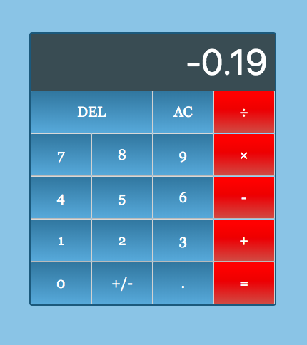

# Calculator

## General Information:
This project was complete following The Odin Project's [curriculum](https://www.theodinproject.com/courses/web-development-101/lessons/calculator). The purpose was to create a simple calculator using the technologies listed below.

## Screenshot:

## Technologies:
- HTML
- CSS
- Vanilla Javascript

## Setup: 
The live version of the webpage can be seen [here](https://tpsst5.github.io/calculator/).
## Status:
This project is complete. If I come back to this in the future I'd like to add keyboard support and the ability to print out additional digits in the result if needed.